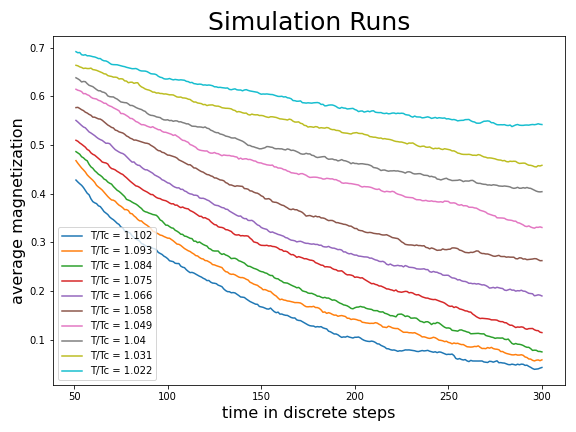
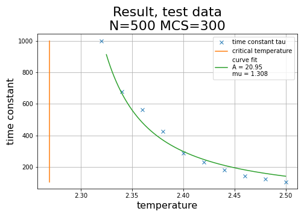
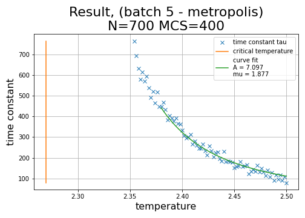
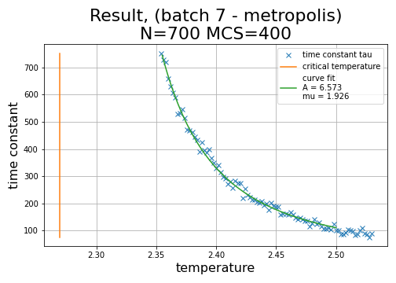
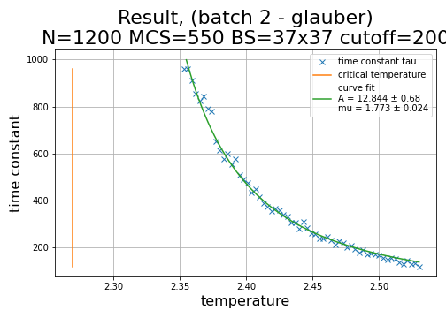

# Ising Model Simulations

Results 

Note on table: for the same run I sometimes threw away data points, either because these data points belonged to regions of high variance (i.e. high temperature T), or because they where outliers. 

|#|trial|N|MCS|#dta pts|cutoff|grid|A|&sigma;(A)|&mu;|&sigma;(&mu;)|Notes|
|:---:|:---:|:---:|:---:|:---:|:---:|:---:|:---:|:---:|:---:|:---:|:---:|
|1|#1-met|500|300|10|50|37x37|20.95|Na|1.308|Na||
|2|#3-met|1200|400|13|100|37x37|7.7|0.6|1.82|0.04||
|3|#4-met|1200|400|43|100|37x37|7.7|0.6|1.83|0.04||
|4|"|"|"|"|150|"|7.6|0.9|1.85|0.06||
|5|#5-met|700|400|24|100|57x57|6.8|0.6|1.89|0.04||
|6|"|"|"|"|150|"|6.25||1.95|||
|7|#6-met|1200|500|64|100|57x57|6.7|0.3|1.90|0.02|cut log T|
|8|"     |"   |"  |64|150|"    |6.2|0.4|1.95|0.03|"|
|9|"     |"   |"  |64|200|"    |5.8|0.5|1.98|0.04|"|
|10|"     |"   |"  |74|100|"    |8.2|0.4|1.80|0.02|all results|
|11|"     |"   |"  |" |150|"    |7.6|0.4|1.84|0.02|"|
|12|"     |"   |"  |" |200|"    |7.1|0.5|1.88|0.03|"|
|13|#7-met|2000|600|88|100|57x57|7.3|0.2|1.86|0.01|all results|
|14|"     |"   |"  |" |150|"    |7.0|0.2|1.89|0.02|"|
|15|"     |"   |"  |" |200|"    |6.6|0.2|1.93|0.02|"|
|16|"     |"   |"  |" |250|"    |6.2|0.3|1.96|0.02|"|
|17|"     |"   |"  |73|100|"    |7.5|0.3|1.84|0.02|range T :2.50|
|18|"     |"   |"  |73|150|"    |7.2|0.3|1.88|0.02|range T :2.50|
|19|"     |"   |"  |73|200|"    |7.5|0.3|1.84|0.02|range T :2.50|
|20|"     |"   |"  |73|250|"    |6.4|0.3|1.95|0.02|"|
|21|#1-glau|500|400|19|100|37x37|14.8|2.0|1.67|0.06|all results|
|22|"      |"  |"  |19|150|"    |13.5|2.6|1.73|0.09|all results|
|23|"      |"  |"  |14|100|"    |15.7|2.7|1.64|0.08|range T :2.50|
|24|#2-glau|1200|550|43|100|37x37|10.8|0.4|1.85|0.02|range T 2.4:2.53|
|25|"      |"   |"  |" |150|"    |10.7|0.5|1.86|0.03|"|
|26|"      |"   |"  |44|200|"    |10.9|0.6|1.86|0.03|"|
|27|"      |"   |"  |34|100|"    |11.3|0.5|1.83|0.03|range T 2.4:2.5|
|28|"      |"   |"  |34|150|"    |11.5|0.7|1.83|0.03|range T 2.4:2.5|
|29|"      |"   |"  |34|200|"    |11.7|0.8|1.82|0.04|range T 2.4:2.5|
|30|"      |"   |"  |59|100|"    |13.9|0.6|1.71|0.02|range T 2.35:2.53|
|31|"      |"   |"  |58|150|"    |13.4|0.7|1.75|0.02|range T 2.35:2.53|
|32|"      |"   |"  |60|200|"    |12.8|0.7|1.77|0.02|range T 2.35:2.53|

## The code

The file *ising.c* contains code adapted from Martin Grant's *ising_2d_in_c.c*, the original code can be found in the *grant/* directory - it runs a single (deterministically seeded) monte carlo simulation and displays on a terminal checkerboard. My code runs many quasi random (time-based seed) simulations.

#### important parameters
- **N** is the number of simulations run per temperatur
- **verbose**, when this is set to true it outputs a running commentary on what is going on (for debugging purposes, mainly to track logic errors and check sanity because this is first time I write code in c)
- **MCS** is the number of trial runs
- **LENGTH** is the sidelength of the square grid with periodic boundary conditions, for the results below, this was chosen to be 37, so the grid is a square (torus) 37x37
- **Tc** the critical temperature is set to 2.2691853142130216092J/c, (approximately 2.269)
- **cutoff** parameter to determine what 'late times' is, all data with *itime < cutoff* is ditched. It can be found in *analysis1_ising.ipynb*. is not part of ising.c.

When **verbose** is set to **false** the program outputs data which can be piped to a csv file. The following pseudocode illustrates what the script does:

```
for a bunch of temperatures in a range (Tc,Tc + epsilon)
	simulate N 2d ising models initiated with all spins up
	for each timestep, average all the simulations' magnetization, print this to a file
```

## Discussion on Results

The following results where generated using *ising.c* with parameters N=500, MCS=300, metropolis rule. To determine *A* and &mu; we first need to determine the time constant &tau; for each run. This was done using *scipy.optimize.curve_fit* to find the optimal value (that minimizes leaste squares error).  

These graphs correspond to row #1 in the table above.




These results are not good enough, we need to make it more accurate, i.e. more runs (higher N), longer runs (higher MCS), a higher cutoff (100 timesteps instead of 50) and perhaps we don't need results for time too close to Tc because it looks like when you get too near the blow up, the errors also blow up... Perhaps we could try a bigger board size...? Though 37 already seems fairly large...

After some more tests we find some strikingly different results, as seen in the table above. I decided it was a good idea to scale the simulations some more and make them run overnight. To make sure that our results where not being contamenated by the transient domain, it was necessary to cut off the first 100 to 200 timesteps of each average run (much experimenting was done). 

There are multiple complications: the temperature can't be too high, or the simulation average will fall to zero too quickly, as the average drops to zero the noise becomes large by comparison and contaminate our results so we cannot obain sensible values of &tau; for large T. When the temperature approaches the critical temperature (i.e. low T, but still higher than Tc!), the transient domain will be longer, so if we include low T data we must throw away a larger chunk of the first few timesteps (order of 100). This means we don't have a large window of temperature for which the estimates of &tau; are both accurate and precise.

The folowing figures correspond to rows #12, #15 and #32 respectively (note #12 has incorrect title, 5 -> 6). Shown here

|#|trial|N|MCS|#dta pts|cutoff|grid|A|&sigma;(A)|&mu;|&sigma;(&mu;)|Notes|
|:---:|:---:|:---:|:---:|:---:|:---:|:---:|:---:|:---:|:---:|:---:|:---:|
|12|#6-metropolis|1200|500|74|200|57x57|7.1|0.5|1.88|0.03|range T 2.35:2.53|
|15|#7-metropolis|2000|600|88|200|57x57|6.6|0.2|1.93|0.02|range T 2.35:2.53|
|32|#2-glauber|1200|550|60|200|37x37|12.8|0.7|1.77|0.02|range T 2.35:2.53|





From these results we can say that the metropolis rule yields a value of A which is just under half that of the glauber rule, and a value for &mu; which is roughly equal to the glauber &mu;. This seems to indicate that the factor A depends on whether we use metropolis or glauber whereas &mu; is a property of the ising model which we measure and is about the same irrespective of the update method used, so long as the method makes physical sense. 


